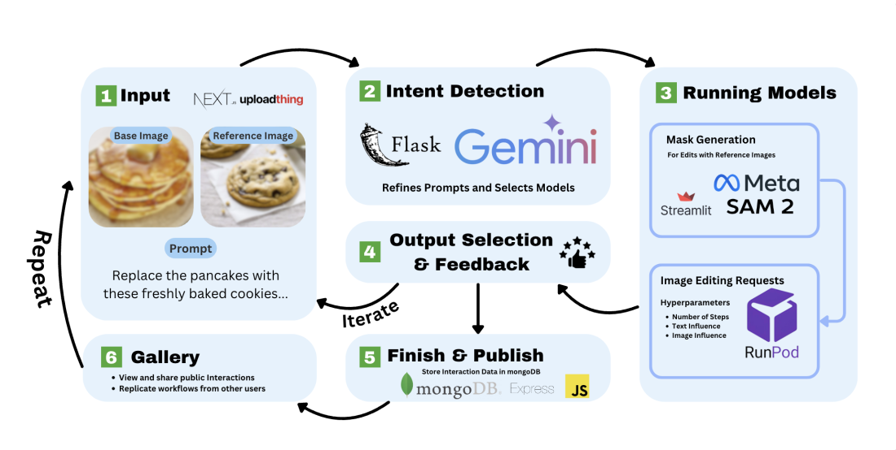

# HILITE: Human-in-the-loop Interactive Tool for Image Editing

You can access the paper [here](https://ieeexplore.ieee.org/document/10825916).

**Abstract**
---
Image editing tools have a plethora of commercial and creative applications — content creation, digital photography, advertisements, graphic design, and development of educational media. The shortcomings of image editing software include difficulty of use and, for AI-based software, reliance on single image editing models, which often poses the dilemma of a tradeoff between image editing quality and user-friendliness. While the performances of individual image editing models have improved with their evolution over time, these singular models are often specialized on specific image editing tasks. In this work, we introduce HILITE, an open-source interactive image editing platform with a human-in-the-loop design that combines six diffusion-based image editing models. For one, HILITE’s accessible and easily-understandable user interface provides a straightforward user workflow from image input and prompt entry to selection of desired output. Secondly, the combination of several models with diverse specializations in turn allows HILITE to generalize on a wide variety of image editing tasks, essentially creating a “one-stop shop” for image editing. Third, HILITE iteratively takes user feedback, which both enhances the user experience and enables collection of crowd-sourced data for image editing. HILITE outperforms two major image editing softwares, OpenAI’s DALL·E 3 and Google’s Imagen 3, across two widely-user quantitative metrics for image editing evaluation. Considering the growing demand for readily-available and high-performing image editing tools, HILITE provides a novel platform design with multifaceted use cases in both business and academia. The platform can be found at https://platform.opennlplabs.org/ or https://platform-deployment.vercel.app/.



HILITE was developed by researchers from OpenNLP Labs in collaboration with Stanford's SALT Lab and CMU's NeuLab. We are extremely grateful for the support and contributions of our mentors Simran Khanuja, Yutong Zhang, Diyi Yang, Graham Neubig, and Subha Vadlamannati in this work.

<div align="center">

# HILITE Model Deployment

</div>

**Supported models on HILITE**
---
HILITE was built on open-source SOTA models and would greatly appreciate your initiative to add more models. 

Currently these models are deployed on the [Runpod Serverless Service](https://www.runpod.io/):
- [AnyDoor: Zero-shot Object-level Image Customization](https://github.com/ali-vilab/AnyDoor)
- [ControlNet Backend with Stable Diffusion v1.5](https://github.com/lllyasviel/ControlNet)
- [DEADiff](https://github.com/bytedance/DEADiff)
- [Inversion-Free Image Editing with Natural Language](https://github.com/sled-group/InfEdit)
- [InstructPix2Pix: Learning to Follow Image Editing Instructions](https://github.com/timothybrooks/instruct-pix2pix)
- [PowerPaint: A Versatile Image Inpainting Model](https://github.com/open-mmlab/PowerPaint)

For ease of use (formulating masks on streamlit interface):
- [Segment Anything 2](https://github.com/facebookresearch/sam2)

**Testing Runpod endpoints locally**
---
All models are packaged into docker images due to Runpod's requirements, here are the docker images of deployed models:
- [AnyDoor: Zero-shot Object-level Image Customization](https://hub.docker.com/repository/docker/jaicode08/anydoor/general)
- [ControlNet Backend with Stable Diffusion v1.5](https://hub.docker.com/repository/docker/jaicode08/controlnet/generalt)
- [DEADiff](https://hub.docker.com/repository/docker/jaicode08/deadiff/general)
- [Inversion-Free Image Editing with Natural Language](https://hub.docker.com/repository/docker/jaicode08/invfree/general)
- [InstructPix2Pix: Learning to Follow Image Editing Instructions](https://hub.docker.com/repository/docker/jaicode08/ip2p/general)
- [PowerPaint: A Versatile Image Inpainting Model](https://hub.docker.com/repository/docker/jaicode08/powerpaint/general)
- [Segment Anything 2](https://hub.docker.com/repository/docker/jaicode08/sam2/general)

Fetch images using this command:
```bash
docker pull jaicode08/<model-name>:latest
```

Run the fetched image:
```bash
docker run -p 8000:8000 jaicode08/<model-name>:latest
```

**Developing Runpod endpoints**
---
Please read through [Runpod's documentation](https://docs.runpod.io/serverless/overview) for developing serverless endpoints

Step by step instructions on how to create your model endpoint:
1. Create a directory for your model
2. Create two folders, one named "builder" and another named "src"
3. Create a Dockerfile
4. In the "builder" folder, create a requierements.txt to store necessary dependencies.
5. In the "src" folder, include necessary code for the model to function. To develop the endpoint for the model, create a file named "handler.py", include necessary inference code and Runpod's required job handler function
6. Additionally, create a Python script that downloads model checkpoints and saves them to their corresponding locations within the model directory. While not necessary for functionality, this script will help other contributors easily set up their working environment.
7. Fill out Dockerfile (make sure to include the necessary python version)

Sample Dockefile:
```docker
FROM python:3.12.4-bookworm

WORKDIR /

COPY builder/requirements.txt .
RUN pip install -r requirements.txt

ADD src .

CMD ["python", "-u", "/handler.py"]
``` 
Your directory structure should look like this:
```
project_directory/
├── builder/
│   └── requirements.txt
├── src/
│   └── handler.py
├── get_ckpts_[model_name].py
├── Dockerfile
```
8. Run the handler.py to make sure the endpoint functions properly, also build the docker image to make sure the code is packaged properly. 

Finally open up a pull request with a link to your public docker image, compute requirements, and endpoint JSON schema.

**Frontend**
---
[Frontend Repository](https://github.com/machine-transcreation/HILITE)
